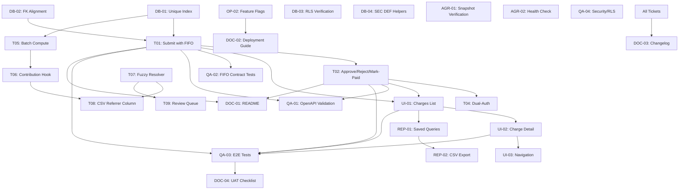

# v1.8.0 - Investor Fee Workflow E2E

**Epic Owner:** orchestrator-pm
**Target Release:** Week of 2025-10-28
**Status:** APPROVED - Ready for Implementation

## Epic Summary

Implement end-to-end investor fee workflow including:
- Charge computation, submission, approval/rejection, mark-paid workflows
- Credit application with FIFO logic (scope-aware)
- CSV import integration with referrer fuzzy matching
- Frontend UI for charge management
- Comprehensive testing, documentation, and deployment infrastructure

## Success Metrics

- 95% referrer auto-link accuracy (≥90% confidence threshold)
- <2s charge list load time
- <1s charge detail load time
- <30s batch compute for 500 contributions
- 8/8 smoke tests passing
- Zero critical bugs in pilot phase

---

## All Tickets (24 Total)

### Backend/Ledger (3 tickets)
- **T01:** Submit charge with FIFO credit application
- **T02:** Approve, reject, mark-paid workflows
- **T04:** Dual-auth enforcement for approve/reject/mark-paid

### CSV/Import (3 tickets)
- **T05:** Batch compute charges from contributions
- **T06:** Contribution create/update hook triggers charge computation
- **T08:** CSV referrer column processing

### Linker (2 tickets)
- **T07:** Fuzzy resolver for referrer matching
- **T09:** Referrer review queue for ambiguous matches

### Frontend (3 tickets)
- **UI-01:** Charges list view (tabs, filters, inline actions)
- **UI-02:** Charge detail view (accordion, workflow buttons)
- **UI-03:** Navigation links and breadcrumbs

### QA (4 tickets)
- **QA-01:** OpenAPI contract validation
- **QA-02:** Contract tests for credit FIFO logic
- **QA-03:** E2E workflow tests
- **QA-04:** Security and RLS policy validation

### Documentation (4 tickets)
- **DOC-01:** README updates (endpoints, workflow)
- **DOC-02:** Deployment guide (flags, rollout)
- **DOC-03:** Status and changelog updates
- **DOC-04:** UAT checklist (10-min pilot runbook)

### Database (4 tickets)
- **DB-01:** Unique index on charge natural keys
- **DB-02:** Foreign key alignment verification
- **DB-03:** RLS policy verification and tests
- **DB-04:** SEC DEF helper functions

### Reports (2 tickets)
- **REP-01:** Saved queries for charge analysis
- **REP-02:** CSV export functionality

### Agreements (2 tickets)
- **AGR-01:** Snapshot verification (pricing preserved)
- **AGR-02:** Health check for agreement-charge relationship

### PM/Operations (1 ticket)
- **OP-01:** Epic creation and ticket management (this document)

---

## Ticket Details

### T01: Submit Charge with FIFO Credit Application

**Owner:** transaction-credit-ledger
**Size:** M (5 story points)
**Status:** TODO
**Dependencies:** DB-01, DB-02

**Description:**
Implement charge submission endpoint that applies available credits using FIFO logic (oldest credits first) with scope-awareness (fund↔fund, deal↔deal).

**Acceptance Criteria:**
1. POST /charges/:id/submit endpoint created
2. Transition charge from DRAFT → PENDING_APPROVAL
3. Apply credits FIFO (oldest created_at first)
4. Scope matching enforced:
   - Fund-scoped charge uses fund-scoped credits (matching fund_id)
   - Deal-scoped charge uses deal-scoped credits (matching deal_id)
   - No cross-scope credit application
5. Update credits_ledger: available_amount decreased, applied_amount increased
6. Populate charge.credits_applied with total applied amount
7. Calculate charge.net_amount = gross - credits_applied
8. Create audit entry: action=charge_submitted, includes credits applied
9. Idempotent: duplicate submissions return 409 if already PENDING
10. RBAC: finance role or higher required (403 if unauthorized)
11. Return 404 if charge not found, 422 if charge not in DRAFT status

**Test Notes:**
- Unit tests: FIFO ordering, scope matching, credit exhaustion
- Integration tests: multi-credit application, partial credit scenarios
- Edge cases: no credits available, credits exceed charge amount, concurrent submissions

**Guardrails:**
- Only paid-in contributions generate charges (not commitments)
- Credits use ledger pattern (no direct balance mutations)
- All state transitions create audit entries

---

### T02: Approve, Reject, Mark-Paid Workflows

**Owner:** transaction-credit-ledger
**Size:** M (5 story points)
**Status:** TODO
**Dependencies:** T01

**Description:**
Implement approve, reject, and mark-paid endpoints with proper state transitions and credit reversals.

**Acceptance Criteria:**
1. POST /charges/:id/approve endpoint:
   - Transition PENDING_APPROVAL → APPROVED
   - Create audit entry: action=charge_approved, approver_id
   - Return 422 if not in PENDING_APPROVAL status
2. POST /charges/:id/reject endpoint:
   - Transition PENDING_APPROVAL → REJECTED
   - Reverse applied credits (restore available_amount in credits_ledger)
   - Create audit entry: action=charge_rejected, reversal_reason required
   - Return 422 if not in PENDING_APPROVAL status, 422 if no reversal_reason
3. POST /charges/:id/mark-paid endpoint:
   - Transition APPROVED → PAID
   - Create audit entry: action=charge_paid, payment_reference required
   - Return 422 if not in APPROVED status, 422 if no payment_reference
4. All endpoints enforce RBAC (admin role required, 403 if unauthorized)
5. All endpoints return correct status codes (200/403/404/422)

**Test Notes:**
- Unit tests: state transitions, credit reversal calculations
- Integration tests: end-to-end workflow (submit → approve → paid)
- Edge cases: invalid status transitions, missing required fields, credit reversal accuracy

**Guardrails:**
- Credit reversals must restore exact amounts (ledger integrity)
- All state transitions create audit entries with user_id and timestamp

---

### T04: Dual-Auth Enforcement for Approve/Reject/Mark-Paid

**Owner:** transaction-credit-ledger
**Size:** S (2 story points)
**Status:** TODO
**Dependencies:** T02

**Description:**
Enforce dual-authorization: user who submits charge cannot approve/reject it.

**Acceptance Criteria:**
1. Check audit_trail for charge_submitted action, extract submitter user_id
2. Return 403 if current user_id matches submitter user_id on approve/reject/mark-paid
3. Error message: "Dual authorization required. User who submitted cannot approve/reject."
4. Bypass check for service role key (system operations)

**Test Notes:**
- Unit tests: submitter vs approver validation
- Integration tests: different users submit and approve
- Edge cases: service role bypass, admin role still enforced

**Guardrails:**
- RBAC enforcement (403 for unauthorized actions)

---

### T05: Batch Compute Charges from Contributions

**Owner:** vantage-csv-integrator
**Size:** M (5 story points)
**Status:** TODO
**Dependencies:** DB-01

**Description:**
Create batch compute endpoint to generate charges for multiple contributions.

**Acceptance Criteria:**
1. POST /charges/batch-compute endpoint with body: { contribution_ids: [] }
2. For each contribution:
   - Fetch agreement snapshot_json pricing (upfront_bps, deferred_bps, vat_rate)
   - Calculate base = paid_in_amount * upfront_bps / 10000
   - Calculate vat = base * vat_rate
   - Calculate gross = base + vat
   - Create charge record: status=DRAFT, contribution_id, investor_party_id, agreement_id
3. Skip contributions without approved agreements (log warning)
4. Return summary: { created: X, skipped: Y, errors: [] }
5. Performance: 500 contributions in <30s
6. RBAC: finance role or higher required

**Test Notes:**
- Unit tests: pricing calculation accuracy, VAT application
- Integration tests: batch processing, error handling
- Performance tests: 500+ contributions load test

**Guardrails:**
- Base calculations on paid-in contributions only
- VAT rates snapshotted at agreement approval (no historical mutations)

---

### T06: Contribution Create/Update Hook Triggers Charge Computation

**Owner:** vantage-csv-integrator
**Size:** S (2 story points)
**Status:** TODO
**Dependencies:** T05

**Description:**
Add trigger to auto-compute charges when contributions are created or updated.

**Acceptance Criteria:**
1. After contribution INSERT/UPDATE, check if agreement is APPROVED
2. If approved and paid_in_amount > 0, call compute charge logic
3. Create charge in DRAFT status
4. Feature flag: auto_compute_charges (enabled by default)
5. Skip if feature flag disabled (manual batch compute only)
6. Log compute success/failure for monitoring

**Test Notes:**
- Integration tests: CSV import triggers charge creation
- Edge cases: contribution updates, duplicate charge prevention

**Guardrails:**
- Additive changes (does not break existing contribution workflows)

---

### T07: Fuzzy Resolver for Referrer Matching

**Owner:** investor-source-linker
**Size:** L (8 story points)
**Status:** TODO
**Dependencies:** None (parallel track)

**Description:**
Implement fuzzy matching algorithm to resolve referrer names to parties.

**Acceptance Criteria:**
1. Function: fuzzy_match_referrer(referrer_name: string) → { party_id, confidence }
2. Algorithm:
   - Normalize input: lowercase, trim, remove special chars
   - Search parties table: type=DISTRIBUTOR
   - Match strategies (in order):
     - Exact match: full_name = referrer_name (100% confidence)
     - Fuzzy match: Levenshtein distance, trigram similarity (70-99% confidence)
     - Partial match: contains or starts-with (60-89% confidence)
3. Return highest confidence match with confidence score
4. Thresholds:
   - ≥90%: auto-link (populate introduced_by_party_id)
   - 80-89%: review queue (create entry for manual review)
   - <80%: no match (log, skip auto-link)
5. Handle multiple matches: return highest confidence, log others
6. Performance: <500ms for single match, <10s for batch (100 names)

**Test Notes:**
- Unit tests: exact match, fuzzy match, partial match, no match
- Integration tests: batch processing, confidence scoring
- Edge cases: multiple distributors with similar names, special characters

**Guardrails:**
- Introduced_by field optional (never required)

---

### T08: CSV Referrer Column Processing

**Owner:** vantage-csv-integrator
**Size:** S (3 story points)
**Status:** TODO
**Dependencies:** T07, T06

**Description:**
Add "Referrer" column to CSV import, trigger fuzzy matching and charge computation.

**Acceptance Criteria:**
1. CSV schema updated: "Referrer" column (optional)
2. During import, if "Referrer" populated:
   - Call fuzzy_match_referrer(referrer_name)
   - If confidence ≥90%: set introduced_by_party_id
   - If 80-89%: create referrer_review_queue entry
   - If <80%: log warning, skip
3. After contribution import, trigger charge computation (via T06 hook)
4. Return import summary: { matched: X, review: Y, no_match: Z }
5. Feature flag: referrer_fuzzy (disabled by default for v1.8.0)

**Test Notes:**
- Integration tests: CSV import with referrer column
- Edge cases: empty referrer, invalid names, batch processing

**Guardrails:**
- Additive changes (existing CSV imports without referrer column still work)

---

### T09: Referrer Review Queue for Ambiguous Matches

**Owner:** investor-source-linker
**Size:** S (3 story points)
**Status:** TODO
**Dependencies:** T07

**Description:**
Create referrer_review_queue table and UI for manual review of ambiguous matches.

**Acceptance Criteria:**
1. Table: referrer_review_queue (id, contribution_id, referrer_name, suggested_party_id, confidence, status, reviewed_by, reviewed_at)
2. GET /referrer-review endpoint: list pending reviews
3. POST /referrer-review/:id/confirm: accept suggested match, update contribution.introduced_by_party_id
4. POST /referrer-review/:id/reject: reject match, mark for manual data entry
5. RBAC: admin role required
6. Status values: PENDING, CONFIRMED, REJECTED

**Test Notes:**
- Integration tests: create review entry, confirm/reject workflows
- Edge cases: stale reviews, contribution deleted

**Guardrails:**
- Introduced_by field optional

---

### UI-01: Charges List View (Tabs, Filters, Inline Actions)

**Owner:** frontend-ui-ux-architect
**Size:** M (5 story points)
**Status:** TODO
**Dependencies:** T01, T02

**Description:**
Create /charges page with tabbed view, filters, and inline submit action.

**Acceptance Criteria:**
1. Route: /charges
2. Tabs: Draft, Pending Approval, Approved, Paid
3. Tab counts: display count of charges in each status
4. Filters: investor (dropdown), date range (from/to), amount range
5. Table columns: Investor, Agreement, Amount, VAT, Credits Applied, Net Amount, Status, Actions
6. Inline actions:
   - Draft tab: "Submit" button (calls POST /charges/:id/submit)
   - Pending tab: "Approve" / "Reject" buttons (admin only)
   - Approved tab: "Mark Paid" button (admin only)
7. Loading states: skeleton loaders during API calls
8. Error handling: toast notifications for API errors
9. Performance: <2s initial load, pagination (50 items/page)
10. RBAC: hide action buttons based on user role

**Test Notes:**
- E2E tests: tab navigation, filter application, inline actions
- Edge cases: empty states, large datasets, permission-based UI

**Guardrails:**
- Error handling: consistent 403/404/422 toast messages

---

### UI-02: Charge Detail View (Accordion, Workflow Buttons)

**Owner:** frontend-ui-ux-architect
**Size:** M (5 story points)
**Status:** TODO
**Dependencies:** UI-01

**Description:**
Create /charges/:id detail page with accordion breakdown and workflow actions.

**Acceptance Criteria:**
1. Route: /charges/:id
2. Header: Investor name, Agreement reference, Status badge
3. Accordion sections:
   - Base Amount: paid_in_amount, upfront_bps, base calculation
   - Discounts: (reserved for future, show $0 if none)
   - VAT: vat_rate, vat_amount
   - Credits Applied: list of credits (FIFO order), amounts, remaining balance
   - Net Amount: final amount due
4. Workflow action buttons:
   - DRAFT: "Submit for Approval"
   - PENDING_APPROVAL: "Approve" / "Reject" (admin only)
   - APPROVED: "Mark as Paid" (admin only)
5. Reject modal: textarea for reversal_reason (required)
6. Mark Paid modal: input for payment_reference (required)
7. Audit trail: table of state transitions (action, user, timestamp)
8. Loading states: skeleton loaders
9. Performance: <1s load time

**Test Notes:**
- E2E tests: accordion expand/collapse, workflow button clicks, modal validations
- Edge cases: no credits, zero VAT, permission-based UI

**Guardrails:**
- Error handling: display validation errors inline

---

### UI-03: Navigation Links and Breadcrumbs

**Owner:** frontend-ui-ux-architect
**Size:** S (1 story point)
**Status:** TODO
**Dependencies:** UI-01

**Description:**
Add "Charges" to main navigation and breadcrumbs.

**Acceptance Criteria:**
1. Main nav: "Charges" link (visible to finance role and above)
2. Breadcrumbs: Home > Charges > [Detail]
3. Feature flag: charges_ui (controls nav visibility)

**Test Notes:**
- E2E tests: nav link click, breadcrumb navigation

**Guardrails:**
- RBAC: hide nav link if user lacks finance role

---

### QA-01: OpenAPI Contract Validation

**Owner:** qa-test-openapi-validator
**Size:** S (2 story points)
**Status:** TODO
**Dependencies:** T01, T02 (can start in parallel)

**Description:**
Validate all new endpoints match OpenAPI specification.

**Acceptance Criteria:**
1. OpenAPI spec updated for all new endpoints:
   - POST /charges/:id/submit
   - POST /charges/:id/approve
   - POST /charges/:id/reject
   - POST /charges/:id/mark-paid
   - POST /charges/batch-compute
   - GET /referrer-review
   - POST /referrer-review/:id/confirm
   - POST /referrer-review/:id/reject
2. Contract tests validate request/response schemas
3. Status codes match spec (200/403/404/409/422)
4. Error response format consistent: { error: { code, message } }

**Test Notes:**
- Contract tests using Postman or OpenAPI validator
- Edge cases: invalid payloads, missing required fields

**Guardrails:**
- Consistent error codes: 422 validation, 403 RBAC, 409 conflicts

---

### QA-02: Contract Tests for Credit FIFO Logic

**Owner:** qa-test-openapi-validator
**Size:** M (3 story points)
**Status:** TODO
**Dependencies:** T01

**Description:**
Create comprehensive contract tests for credit application FIFO logic.

**Acceptance Criteria:**
1. Test scenarios:
   - Single credit fully applied
   - Multiple credits applied FIFO (oldest first)
   - Credits exceed charge amount (partial application of newest credit)
   - No credits available (charge.net_amount = gross)
   - Scope matching (fund↔fund, deal↔deal)
   - Credit reversal on reject (balance restored)
2. Assertions:
   - credits_ledger.available_amount decreased correctly
   - charge.credits_applied matches sum of applied amounts
   - charge.net_amount = gross - credits_applied
   - Oldest credits applied first (created_at ASC)
3. All tests passing, documented in test suite

**Test Notes:**
- Integration tests with real database
- Edge cases: concurrent submissions, credit exhaustion mid-batch

**Guardrails:**
- Credits use ledger pattern (no direct balance mutations)

---

### QA-03: E2E Workflow Tests

**Owner:** qa-test-openapi-validator
**Size:** M (5 story points)
**Status:** TODO
**Dependencies:** UI-01, UI-02, T01, T02

**Description:**
Create end-to-end tests for full charge workflow.

**Acceptance Criteria:**
1. E2E test suite covers:
   - CSV import with referrer → charges created
   - Submit charge → status PENDING, credits applied
   - Approve charge → status APPROVED
   - Reject charge → status REJECTED, credits reversed
   - Mark paid → status PAID
   - UI navigation: list → detail → workflow actions
2. Test data: 5 investors, 1 distributor, 6 contributions, 3 credits
3. All smoke tests (8/8) passing
4. Tests run in CI/CD pipeline (automated)

**Test Notes:**
- E2E framework: Playwright or Cypress
- Edge cases: concurrent users, network failures

**Guardrails:**
- No regressions: v1.7.0 smoke tests still pass

---

### QA-04: Security and RLS Policy Validation

**Owner:** qa-test-openapi-validator
**Size:** S (3 story points)
**Status:** TODO
**Dependencies:** T01, T02 (can run in parallel with QA-03)

**Description:**
Validate RBAC enforcement and RLS policies.

**Acceptance Criteria:**
1. RBAC matrix tested:
   - Finance: submit charges (403 on approve/reject/mark-paid)
   - Admin: all operations (submit, approve, reject, mark-paid)
   - Service role: bypass dual-auth checks
2. RLS policies validated:
   - charges table: users only see charges for their authorized parties
   - credits_ledger: users only see credits for their authorized parties
3. Negative tests:
   - Unauthorized user attempts charge operations (expect 403)
   - User attempts approve on own submission (expect 403 dual-auth)
4. Service role key bypass tested (authorized_user_id header)

**Test Notes:**
- Security tests with multiple user roles
- Edge cases: role changes mid-session, token expiry

**Guardrails:**
- RBAC enforcement: 403 for unauthorized actions

---

### DOC-01: README Updates (Endpoints, Workflow)

**Owner:** docs-change-control
**Size:** S (2 story points)
**Status:** TODO
**Dependencies:** T01, T02 (wait for implementation to document)

**Description:**
Update README with new endpoints and workflow documentation.

**Acceptance Criteria:**
1. Endpoints section updated with all new APIs (8 endpoints)
2. Workflow diagram added: DRAFT → PENDING → APPROVED → PAID (or REJECTED)
3. Credit application logic documented (FIFO, scope-aware)
4. Code examples for each endpoint (curl or TypeScript)
5. Error codes documented (200/403/404/409/422)

**Test Notes:**
- Documentation review by stakeholder
- Verify code examples run successfully

**Guardrails:**
- Documentation for API contracts required

---

### DOC-02: Deployment Guide (Flags, Rollout)

**Owner:** docs-change-control
**Size:** S (2 story points)
**Status:** TODO
**Dependencies:** OP-02 (feature flags defined)

**Description:**
Create deployment guide with feature flags and rollout plan.

**Acceptance Criteria:**
1. Feature flags documented (4 flags)
2. Rollout phases documented (4 phases: pilot → finance → org → fuzzy)
3. Rollback procedures documented (flag disable, function revert)
4. Migration instructions (if any database changes)
5. Health check commands (verify deployment success)

**Test Notes:**
- Deployment guide tested in staging
- Rollback procedure tested

**Guardrails:**
- Deployment guide required for release

---

### DOC-03: Status and Changelog Updates

**Owner:** docs-change-control
**Size:** S (1 story point)
**Status:** TODO
**Dependencies:** All tickets (wait for completion)

**Description:**
Update CHANGELOG with v1.8.0 changes.

**Acceptance Criteria:**
1. CHANGELOG.md updated:
   - Version: v1.8.0
   - Release date: [DATE]
   - New features: charge workflows, referrer fuzzy matching
   - API changes: 8 new endpoints
   - Breaking changes: none
2. Status dashboard updated (if applicable)

**Test Notes:**
- Changelog reviewed by stakeholder

**Guardrails:**
- Changelog required for release

---

### DOC-04: UAT Checklist (10-Min Pilot Runbook)

**Owner:** docs-change-control
**Size:** S (2 story points)
**Status:** TODO
**Dependencies:** QA-03 (smoke tests defined)

**Description:**
Create 10-minute pilot runbook for UAT validation.

**Acceptance Criteria:**
1. Checklist format: step-by-step instructions
2. Steps cover:
   - CSV import with referrer
   - Verify charges created
   - Submit charge
   - Approve charge
   - Mark paid
   - Verify credits applied FIFO
3. Expected results documented for each step
4. Troubleshooting section (common errors, resolutions)
5. Runbook tested in staging (10 min completion time)

**Test Notes:**
- Pilot users test runbook in staging

**Guardrails:**
- UAT checklist required for pilot phase

---

### DB-01: Unique Index on Charge Natural Keys

**Owner:** postgres-schema-architect
**Size:** S (1 story point)
**Status:** TODO
**Dependencies:** None (foundational work)

**Description:**
Add unique constraint on (contribution_id, investor_party_id) to prevent duplicate charges.

**Acceptance Criteria:**
1. Migration: CREATE UNIQUE INDEX charges_unique_contribution_investor ON charges (contribution_id, investor_party_id) WHERE deleted_at IS NULL
2. Test: INSERT duplicate charge returns 409 conflict error
3. Migration tested in staging before production

**Test Notes:**
- Integration tests: duplicate charge prevention
- Edge cases: soft-deleted charges

**Guardrails:**
- Migration instructions required for schema changes

---

### DB-02: Foreign Key Alignment Verification

**Owner:** postgres-schema-architect
**Size:** S (1 story point)
**Status:** TODO
**Dependencies:** None (foundational work)

**Description:**
Verify foreign key relationships for charges table.

**Acceptance Criteria:**
1. Verify FKs:
   - charges.contribution_id → contributions.id
   - charges.investor_party_id → parties.id
   - charges.agreement_id → agreements.id
   - charges.introduced_by_party_id → parties.id (nullable)
2. Test: DELETE parent record fails with FK constraint error
3. Document FK relationships in schema diagram

**Test Notes:**
- Integration tests: FK constraint enforcement
- Edge cases: cascading deletes, orphaned records

**Guardrails:**
- Referential integrity enforced

---

### DB-03: RLS Policy Verification and Tests

**Owner:** postgres-schema-architect
**Size:** S (2 story points)
**Status:** TODO
**Dependencies:** None (can run in parallel)

**Description:**
Verify RLS policies for charges and credits_ledger tables.

**Acceptance Criteria:**
1. RLS policies defined:
   - charges: users see charges for authorized parties only
   - credits_ledger: users see credits for authorized parties only
2. Test: user queries return only authorized records
3. Test: unauthorized user gets empty result set (not 403)
4. Service role key bypasses RLS (authorized_user_id header)

**Test Notes:**
- Security tests with multiple user roles
- Edge cases: cross-tenant access attempts

**Guardrails:**
- RLS policies required for all tables with PII

---

### DB-04: SEC DEF Helper Functions

**Owner:** postgres-schema-architect
**Size:** S (2 story points)
**Status:** TODO
**Dependencies:** None

**Description:**
Create SEC DEF helper functions for charge calculations.

**Acceptance Criteria:**
1. Function: calculate_charge_base(paid_in_amount, upfront_bps) → base_amount
2. Function: calculate_charge_vat(base_amount, vat_rate) → vat_amount
3. Function: calculate_charge_gross(base_amount, vat_amount) → gross_amount
4. Functions tested with various inputs (edge cases: zero amounts, high bps)
5. Functions marked SECURITY DEFINER with IMMUTABLE flag

**Test Notes:**
- Unit tests: calculation accuracy, edge cases
- Edge cases: null inputs, negative amounts, overflow

**Guardrails:**
- Base calculations on paid-in contributions only

---

### REP-01: Saved Queries for Charge Analysis

**Owner:** dashboard-reports-builder
**Size:** S (2 story points)
**Status:** TODO
**Dependencies:** UI-01 (charge list exists)

**Description:**
Create saved queries for common charge analysis.

**Acceptance Criteria:**
1. Queries:
   - Charges by status (breakdown: draft/pending/approved/paid)
   - Charges by investor (top 10 by amount)
   - Credits applied summary (total applied, by investor)
   - Monthly charge volume (count, total amount)
2. Queries saved in dashboard tool (Retool, Metabase, etc.)
3. Queries tested with staging data

**Test Notes:**
- Performance tests: query execution <5s
- Edge cases: empty datasets, large date ranges

**Guardrails:**
- Reports do not expose PII to unauthorized users

---

### REP-02: CSV Export Functionality

**Owner:** dashboard-reports-builder
**Size:** S (2 story points)
**Status:** TODO
**Dependencies:** REP-01

**Description:**
Add CSV export for charge list and reports.

**Acceptance Criteria:**
1. Export button on /charges page
2. CSV columns: Investor, Agreement, Base, VAT, Credits Applied, Net, Status, Date
3. Filters applied to export (only visible records exported)
4. RBAC: finance role or higher required
5. Performance: 1000 records exported in <10s

**Test Notes:**
- Integration tests: export with filters
- Edge cases: large datasets, special characters in names

**Guardrails:**
- RBAC enforcement: 403 for unauthorized exports

---

### AGR-01: Snapshot Verification (Pricing Preserved)

**Owner:** agreement-docs-repository
**Size:** S (2 story points)
**Status:** TODO
**Dependencies:** None (parallel work)

**Description:**
Verify agreement snapshot_json preserves pricing on approval.

**Acceptance Criteria:**
1. When agreement transitions to APPROVED:
   - snapshot_json captures: upfront_bps, deferred_bps, vat_rate
2. Test: update pricing after approval does not affect snapshot_json
3. Charge calculations use snapshot_json (not current pricing)
4. Audit trail logs snapshot creation

**Test Notes:**
- Integration tests: snapshot immutability
- Edge cases: agreement versioning, snapshot corruption

**Guardrails:**
- VAT rates snapshotted at approval (no historical mutations)

---

### AGR-02: Health Check for Agreement-Charge Relationship

**Owner:** agreement-docs-repository
**Size:** S (1 story point)
**Status:** TODO
**Dependencies:** None (parallel work)

**Description:**
Create health check query to verify agreement-charge data integrity.

**Acceptance Criteria:**
1. Query checks:
   - All charges have valid agreement_id (FK exists)
   - All charges reference APPROVED agreements only
   - Charge pricing matches agreement snapshot_json
2. Query returns anomalies (if any)
3. Query run weekly in monitoring dashboard

**Test Notes:**
- Integration tests: detect orphaned charges, pricing mismatches

**Guardrails:**
- Referential integrity enforced

---

## Dependency Graph

```
CRITICAL PATH (blocks release):
DB-01 ──┬──> T01 ──> T02 ──> T04
DB-02 ──┘       │
                ├──> UI-01 ──> UI-02 ──> UI-03
                │       │
                │       └──> REP-01 ──> REP-02
                │
                └──> QA-03 ──> DOC-04

PARALLEL TRACK - CSV/Import:
T05 ──> T06 ──┬──> T08
              │
T07 ──────────┴──> T09

PARALLEL TRACK - QA (can start early):
QA-01 (parallel with T01/T02)
QA-02 (depends on T01)
QA-04 (parallel with QA-03)

PARALLEL TRACK - Docs:
DOC-01 (after T01/T02 implementation)
DOC-02 (after OP-02 feature flags)
DOC-03 (after all tickets complete)

PARALLEL TRACK - DB (foundational, start immediately):
DB-03 (parallel, no dependencies)
DB-04 (parallel, no dependencies)

PARALLEL TRACK - Agreements (no dependencies):
AGR-01 (parallel)
AGR-02 (parallel)
```

## Dependency Visualization (Mermaid)



---

## Owner Assignments

| Owner | Tickets | Count |
|-------|---------|-------|
| transaction-credit-ledger | T01, T02, T04 | 3 |
| vantage-csv-integrator | T05, T06, T08 | 3 |
| investor-source-linker | T07, T09 | 2 |
| frontend-ui-ux-architect | UI-01, UI-02, UI-03 | 3 |
| qa-test-openapi-validator | QA-01, QA-02, QA-03, QA-04 | 4 |
| docs-change-control | DOC-01, DOC-02, DOC-03, DOC-04 | 4 |
| postgres-schema-architect | DB-01, DB-02, DB-03, DB-04 | 4 |
| dashboard-reports-builder | REP-01, REP-02 | 2 |
| agreement-docs-repository | AGR-01, AGR-02 | 2 |
| orchestrator-pm | OP-01 | 1 |

**Total:** 24 tickets, 10 owners

---

## Status Board (Initial State)

**TODO:** 24 tickets
**DOING:** 0 tickets
**REVIEW:** 0 tickets
**DONE:** 0 tickets

---

## Success Metrics

- All 24 tickets closed (DoD met)
- 8/8 smoke tests passing
- Zero critical bugs in pilot phase
- <2s charge list load time
- <1s charge detail load time
- <30s batch compute for 500 contributions
- 95% referrer auto-link accuracy (≥90% confidence)

---

## Next Actions

1. **DB team (postgres-schema-architect):** Start DB-01, DB-02, DB-03, DB-04 immediately (foundational work)
2. **Backend team (transaction-credit-ledger):** Wait for DB-01, DB-02 completion, then start T01
3. **PM (orchestrator-pm):** Complete OP-02 (feature flags) to unblock DOC-02
4. **CSV team (vantage-csv-integrator):** Start T05 after DB-01 complete
5. **Linker team (investor-source-linker):** Start T07 immediately (parallel track)
6. **Agreements team (agreement-docs-repository):** Start AGR-01, AGR-02 immediately (parallel track)

---

**Document Status:** APPROVED
**Last Updated:** 2025-10-21
**Next Review:** Daily standup
